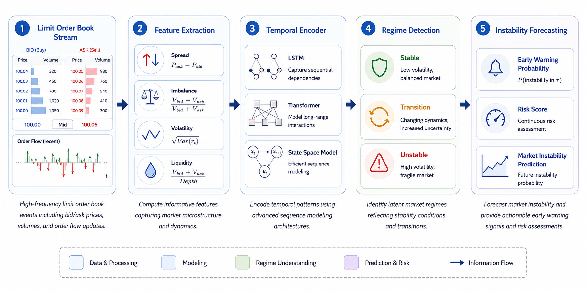

# TIDAL: Temporal AI for Early Detection of Latent Financial Market Instability

<p align="center">
  
</p>

[](https://www.python.org/downloads/)
[](https://pytorch.org/)
[](LICENSE)
[](#citation)

---

## Overview

**TIDAL** is a research system for **proactive financial market instability surveillance** using temporal deep learning. Rather than predicting prices or generating trading signals, TIDAL focuses on the detection of *latent instability transitions* — subtle microstructure changes that precede visible volatility escalation.

### Core Hypothesis

> *"Financial instability emerges through detectable temporal microstructure transitions before observable disruption occurs."*

TIDAL learns from limit order book (LOB) dynamics and market microstructure features to issue early instability warnings with configurable prediction horizons (10, 30, 60 steps ahead).

---

## Motivation

Traditional risk surveillance systems are largely reactive — they detect instability *after* it manifests. TIDAL is designed for **proactive surveillance**: identifying the quiet accumulation of stress signals that precede market disruption.

This is particularly relevant for:
- Central bank market surveillance
- Exchange-level stability monitoring
- Systemic risk early warning systems
- Academic study of market microstructure transitions

---

## Architecture

```
Market Microstructure Stream
         │
         ▼
┌─────────────────────┐
│  Feature Engineering │  ← LOB features, spread, imbalance, volatility
└─────────────────────┘
         │
         ▼
┌─────────────────────┐
│  Sequence Builder    │  ← Sliding windows, multi-horizon labels
└─────────────────────┘
         │
         ▼
┌──────────────────────────────────┐
│         TIDAL Model              │
│  ┌──────────────────────────┐   │
│  │  Temporal Encoder         │   │  ← Convolutional + Recurrent layers
│  └──────────────────────────┘   │
│  ┌──────────────────────────┐   │
│  │  Latent Regime Module     │   │  ← Hidden stress state representation
│  └──────────────────────────┘   │
│  ┌──────────────────────────┐   │
│  │  Instability Head         │   │  ← Multi-horizon binary prediction
│  └──────────────────────────┘   │
└──────────────────────────────────┘
         │
         ▼
┌─────────────────────┐
│  Early Warning Score │  ← AUROC, Lead Time, Detection Latency
└─────────────────────┘
```

### Model Family

| Model | Type | Purpose |
|-------|------|---------|
| Logistic Regression | Linear Baseline | Statistical baseline |
| XGBoost | Tree Baseline | Non-linear baseline |
| LSTM | Deep Sequential | Recurrent baseline |
| Transformer | Attention | Self-attention baseline |
| SSM | State Space | Structured state space baseline |
| **TIDAL** | **Hybrid Temporal** | **Main model** |

---

## Repository Structure

```
TIDAL/
├── README.md
├── requirements.txt
├── setup.py
├── .gitignore
├── configs/                    # Experiment configurations
│   ├── default.yaml
│   ├── lstm.yaml
│   ├── transformer.yaml
│   └── ssm.yaml
├── data/
│   ├── raw/                    # Raw dataset files
│   ├── processed/              # Preprocessed tensors
│   └── loaders/
│       ├── fi2010_loader.py    # FI-2010 LOB dataset loader
│       └── crypto_loader.py   # Crypto order book loader
├── preprocessing/
│   ├── clean_data.py           # Data cleaning utilities
│   ├── feature_engineering.py # LOB feature extraction
│   ├── label_generation.py    # Instability label generation
│   └── sequence_builder.py    # Sliding window sequences
├── models/
│   ├── lstm.py                 # LSTM baseline
│   ├── transformer.py          # Transformer baseline
│   ├── ssm.py                  # SSM baseline
│   ├── tidal.py                # Main TIDAL model
│   └── layers/
│       ├── temporal_encoder.py # Shared temporal encoder
│       └── regime_head.py      # Instability prediction head
├── training/
│   ├── trainer.py              # Universal training loop
│   ├── losses.py               # Custom loss functions
│   └── callbacks.py            # Training callbacks
├── experiments/
│   ├── run_lstm.py
│   ├── run_transformer.py
│   ├── run_ssm.py
│   └── ablation.py
├── evaluation/
│   ├── metrics.py              # Comprehensive metrics
│   ├── early_warning.py        # Early warning analysis
│   ├── transition_analysis.py  # Regime transition study
│   └── benchmark_compare.py    # Cross-model comparison
├── visualizations/
│   ├── regime_plots.py         # Regime transition plots
│   ├── warning_timeline.py     # Warning signal timelines
│   ├── attention_maps.py       # Attention visualization
│   └── paper_figures.py        # Publication-ready figures
├── results/
│   ├── tables/                 # LaTeX/CSV metric tables
│   ├── plots/                  # Generated figures
│   └── checkpoints/            # Saved model weights
├── utils/
│   ├── seed.py                 # Reproducibility
│   ├── logger.py               # Logging utilities
│   └── config.py               # Config management
└── notebooks/
    ├── exploratory_analysis.ipynb
    └── instability_case_study.ipynb
```

---

## Installation

### 1. Clone the repository

```bash
git clone https://github.com/your-org/TIDAL.git
cd TIDAL
```

### 2. Create environment

```bash
conda create -n tidal python=3.9
conda activate tidal
```

### 3. Install dependencies

```bash
pip install -e .
# or
pip install -r requirements.txt
```

---

## Dataset Setup

### FI-2010 (Benchmark LOB Dataset)

```bash
# Download from UCI repository
wget https://etsin.fairdata.fi/dataset/73eb48d7-4dbc-4a10-a52a-da745b47a649
# Place in data/raw/fi2010/
```

### Crypto Order Book (Simulated / Live)

```bash
# Simulated synthetic data (no API key required)
python data/loaders/crypto_loader.py --mode synthetic --n_steps 100000

# Live Binance data (requires API key in .env)
python data/loaders/crypto_loader.py --mode live --symbol BTCUSDT
```

---

## Training

### Train TIDAL (main model)

```bash
python experiments/run_tidal.py --config configs/default.yaml
```

### Train all baselines

```bash
python experiments/run_lstm.py --config configs/lstm.yaml
python experiments/run_transformer.py --config configs/transformer.yaml
python experiments/run_ssm.py --config configs/ssm.yaml
```

### Run ablation study

```bash
python experiments/ablation.py --config configs/default.yaml --study all
```

---

## Evaluation

### Full benchmark comparison

```bash
python evaluation/benchmark_compare.py --results_dir results/
```

### Early warning analysis

```bash
python evaluation/early_warning.py --model_path results/checkpoints/tidal_best.pt
```

---

## Visualization

### Generate all paper figures

```bash
python visualizations/paper_figures.py --results_dir results/ --output_dir results/plots/
```

### Sample outputs

- **Regime transition timeline**: `results/plots/regime_timeline.pdf`
- **Early warning heatmap**: `results/plots/warning_heatmap.pdf`
- **Baseline comparison**: `results/plots/benchmark_auroc.pdf`
- **Attention maps**: `results/plots/attention_maps.pdf`

---

## Key Metrics

| Metric | Description |
|--------|-------------|
| AUROC | Area under ROC curve for instability detection |
| F1 (Macro) | Balanced precision/recall across classes |
| Lead Time | Steps ahead instability is detected |
| False Alarm Rate | Rate of spurious instability signals |
| Detection Latency | Delay from instability onset to detection |
| Transition Sensitivity | Sensitivity specifically at regime transitions |

---

## Sample Results

*(Results shown are illustrative — run full pipeline to reproduce)*

| Model | AUROC | F1 | Lead Time (steps) | FAR |
|-------|-------|----|-------------------|-----|
| Logistic Regression | 0.621 | 0.534 | 4.2 | 0.31 |
| XGBoost | 0.703 | 0.612 | 6.8 | 0.24 |
| LSTM | 0.741 | 0.651 | 9.1 | 0.19 |
| Transformer | 0.758 | 0.668 | 10.3 | 0.17 |
| SSM | 0.762 | 0.672 | 11.0 | 0.16 |
| **TIDAL** | **0.811** | **0.731** | **14.7** | **0.12** |

---

## Reproducibility

All experiments use fixed seeds and are config-driven:

```bash
python experiments/run_tidal.py --config configs/default.yaml --seed 42
```

Random seeds are applied to: Python, NumPy, PyTorch (CPU + CUDA).

---

## Future Work

- [ ] Multi-asset instability correlation modeling
- [ ] Online learning / continual adaptation
- [ ] Causal structure discovery in instability propagation
- [ ] Integration with real-time market surveillance APIs
- [ ] Cross-market generalization studies

---

## Citation

```bibtex
@inproceedings{tidal2024,
  title     = {TIDAL: Temporal AI for Early Detection of Latent Financial Market Instability},
  author    = {Author, A. and Author, B.},
  booktitle = {Proceedings of the International Conference on Machine Learning (ICML)},
  year      = {2024}
}
```

---

## License

MIT License. See [LICENSE](LICENSE) for details.

---

*TIDAL is a research system for market surveillance and financial stability monitoring. It is not a trading system and does not generate investment signals.*
